  <h1>👋 Hey, I'm Aiden</h1>
  
  

    <b>Undergraduate Physics Student</b> • Based in Malta 🇲🇹
  

  

    
    
    
  

   

  ## 🚀 About Me

  🔭 Working on [Worther](https://worther.vercel.app/), developing aircraft for MSFS with [Horizon Simulations](https://github.com/Horizon-Simulations) & [Lunar Simulations](https://lunar-simulations.github.io/)  
  🌱 Currently learning **Zig**  
  ⚡ Hobbies: Coding • Football • Gaming • Aviation • Flight Sim • Rockets & Space  

   

  ## 📊 GitHub Stats

  

    
    
  

   

  ## 📅 Contribution Calendar

  

   

  ## ⭐ Top Starred Repositories

  

   

  ## 🏆 GitHub Trophies

  

   

  ## 🛠️ Tech Stack

  **Languages**
  
  

    
    
    
    
    
    
    
    
  

  **Frontend**
  
  

    
    
    
    
    
    
    
  

  **Backend & Cloud**
  
  

    
    
    
    
    
    
    
    
  

  **Tools & Systems**
  
  

    
    
    
    
    
    
    
  

   

  ## 💖 Support My Work

  

    
    &nbsp;&nbsp;
    
    &nbsp;&nbsp;
    
  

   

