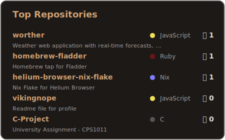

  <h1>Hi  My name is Aiden</h1>

  

    <b>University Student and Former Junior Software Developer</b> 
    Based in Malta 🇲🇹 • Majoring in Physics
  

  

    &nbsp;&nbsp;
  

   

  <!-- Stats & Top Languages Side-by-Side -->
  

    &nbsp;
  

 

## 🚀 About Me

- 🔭 I'm currently working on [Worther](https://worther.vercel.app/), and with both the [Horizon Simulations](https://github.com/Horizon-Simulations) team and the [Lunar Simulations](https://lunar-simulations.github.io/) team developing aircraft for Microsoft Flight Simulator.
- 🌱 I'm currently learning **Rust**.
- ⚡ **Hobbies**: Coding, Football, Gaming, Aviation, Flight Simulation, Rockets and Space.

 

  
  <h3>🛠️ Skills</h3>

  
<b>Languages</b>

  

    
    
    
    
    
    
    
  

  
<b>Frontend</b>

  

    
    
    
    
    
  

  
<b>Backend & Cloud</b>

  

    
    
    
    
  

  
<b>Tools & Systems</b>

  

    
    
    
    
  

   

  <h3>🏆 Top Repositories</h3>

  

    
  

    

  <h3>☕ Support Me</h3>

  

    &nbsp;&nbsp;
  

